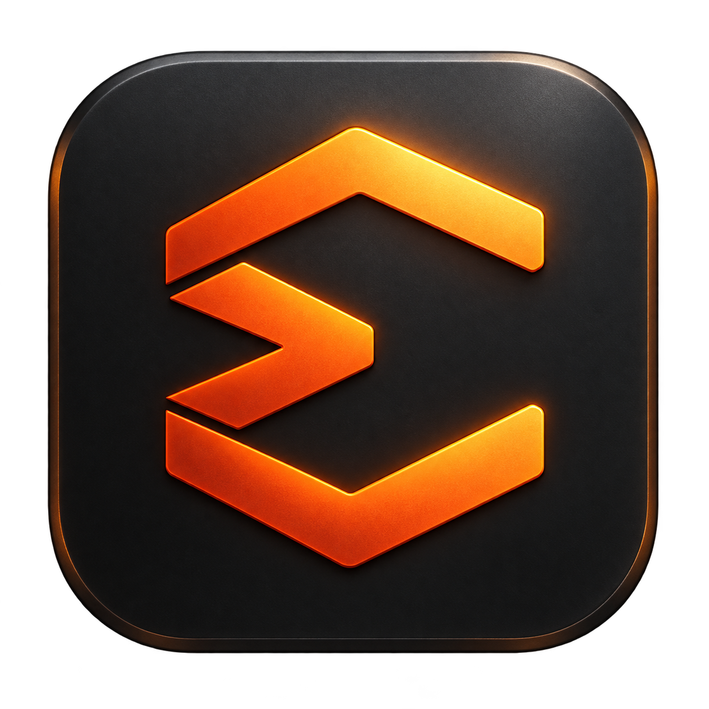
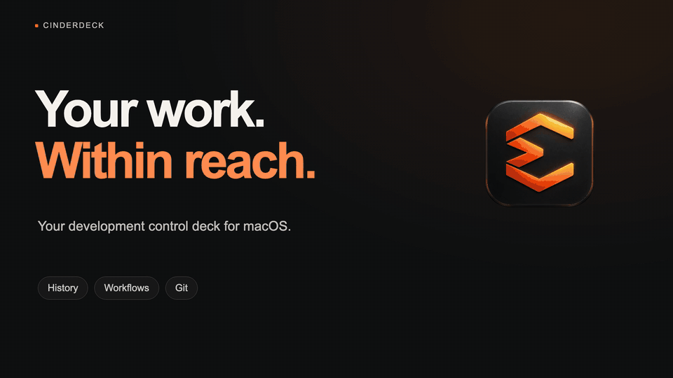

<p align="center">
  
</p>

<h1 align="center">Cinderdeck</h1>
<p align="center"><strong>Your development control deck for macOS.</strong><br />Your projects. Your commands. One place to run them.</p>

<p align="center">
  <a href="docs/STACKS.md">Set up a stack</a> ·
  <a href="docs/BUILD.md">Build the app</a> ·
  <a href="docs/README.md">Documentation</a> ·
  <a href="https://github.com/RyanCardin15/Cinderdeck/issues">Issues</a>
</p>

<p align="center">
  <a href="assets/cinderdeck-promo.mp4?raw=true">
    
  </a>
  <br />
  <a href="assets/cinderdeck-promo.mp4?raw=true"><strong>▶ Watch the 30-second promo with sound</strong></a>
</p>

Cinderdeck is a native Mac application for running your development environment. Group any set of projects into a stack, define how each service starts, and manage them together from the menu bar, a terminal, or your coding agent.

A web app, an API in another repository, a worker, a local database: bring whatever your project needs. No prescribed repositories, language, framework, or folder layout. Cinderdeck runs the commands you configure using the tools already installed on your Mac.

**Cinderdeck is an independent fork of [Snapzy](https://github.com/duongductrong/Snapzy), created by Trong Duong Duc and its contributors.** Snapzy supplied the native capture, recording, annotation, and editing foundation. Cinderdeck extends that foundation into a development workspace with configurable stacks, service orchestration, agent controls, and local clipboard history. The original [BSD 3-Clause license](LICENSE) and attribution are preserved; see [NOTICE](NOTICE).

## A place for the whole project

- **Run any stack.** Add project folders and start commands, with optional Git repositories, environment variables, Keychain references, dependencies, and readiness checks.
- **See what is running.** Service status, listening ports, process ownership, live logs, crash output, and activity live together. Start, stop, or restart individual services or an entire stack.
- **Work across repositories.** Inspect branches and changes, fetch or pull, and switch branches with explicit stash/carry choices.
- **Give agents the same controls.** The `cinderdeck` CLI and local MCP server work with Codex, Cursor, Claude Code, and other clients. Agent identity and advisory claims make ownership visible.
- **Organize your GitHub work.** Browse repositories, sync GitHub stars, filter pull requests, save custom views, inspect changes, and submit reviews in a native PRs workspace. [Explore pull requests](docs/PULL_REQUESTS.md).
- **Keep useful context nearby.** Local text clipboard history, capture history, and search sit alongside your stacks.
- **Capture what you are building.** Screenshots, scrolling capture, screen recording, annotation, OCR, and video editing remain available from the Snapzy foundation.

Built with SwiftUI and AppKit. Local configuration, local history, no Cinderdeck account. Cloud uploads and custom OCR endpoints are optional and explicitly configured.

## Start with your own projects

Build and open the app, then use **⌘⇧H → Stacks → Create stack**. Choose your folders and enter the commands you already use. Expand the panel with **⌘E** for logs and service controls. Shortcuts can be customized in Settings.

Definitions are ordinary TOML files in `~/.config/cinderdeck/stacks/`. This example combines two independent projects; replace the paths and commands with your own:

```toml
name = "My workspace"
root = "~/Projects"

[repos.web]
path = "my-web-app"

[repos.api]
path = "my-api"

[services.api]
repo = "api"
cmd = "npm run dev"
port = 4000
ready.port = 4000

[services.web]
repo = "web"
cmd = "npm run dev"
depends_on = ["api"]
port = 3000
url = "http://localhost:3000"
ready.port = 3000
```

Saving a definition reloads it. Starting services is explicit. Git is optional; a service can use `cwd` instead of a repository. Dependencies and runtimes are installed by you, not by importing a stack. [Read the full stack guide](docs/STACKS.md).

## Terminal and coding agents

In the Stacks panel, open **Agents & CLI** to install the command and view setup instructions. Or run:

```sh
/Applications/Cinderdeck.app/Contents/MacOS/Cinderdeck stacks install-cli
# Make sure ~/.local/bin is on your PATH.
cinderdeck stacks status
cinderdeck stacks start my-workspace --as Codex
cinderdeck stacks logs my-workspace -f
cinderdeck stacks stop my-workspace
cinderdeck stacks setup-agents --print
```

Use the filename without `.toml` as the stack ID. `cinderdeck mcp` exposes the same controls over MCP stdio. Agent setup changes client configuration only when you run the setup command. Use `cinderdeck stacks agent-help` for the full command reference and agent instructions.

## Build Cinderdeck

Requires macOS 13 or later and **Xcode 26.2 or later** to build the current Swift source. Open `Cinderdeck.xcodeproj` and select the **Cinderdeck** scheme, or use:

```sh
git clone https://github.com/RyanCardin15/Cinderdeck.git
cd Cinderdeck
xcodebuild -project Cinderdeck.xcodeproj -scheme Cinderdeck \
  -configuration Debug -destination 'platform=macOS' \
  -derivedDataPath .build/development \
  CODE_SIGN_IDENTITY=- CODE_SIGN_STYLE=Manual DEVELOPMENT_TEAM= build
open '.build/development/Build/Products/Debug/Cinderdeck Debug.app'
```

For a signed app in `/Applications`, testing, and release packaging, see [the build guide](docs/BUILD.md). Cinderdeck starts its own version line at **1.0.0 (200)**. This source release does not claim Snapzy’s downloads, Homebrew package, notarization, or update signatures. Automatic updates stay off until Cinderdeck’s own signed release feed is configured; **Check for Updates** opens this repository’s releases.

## Coming from the customized Snapzy build

On its first Release launch, Cinderdeck copies your existing local history database, configuration, stacks, preferences, and logs into its own locations. It preserves the originals and never overwrites existing Cinderdeck data. Custom project paths and original capture files stay where you chose to save them. Existing Keychain identifiers and `snapzy://` shortcuts remain supported for compatibility.

The application has a new bundle identity, so macOS may ask you to grant capture or accessibility permissions to **Cinderdeck**. See [migration and compatibility](docs/MIGRATION.md).

## Documentation and contributing

[Stacks](docs/STACKS.md) · [Configuration](docs/CONFIGURATION.md) · [History](docs/HISTORY.md) · [Capture](docs/CAPTURE.md) · [Recording](docs/RECORDING.md) · [Contributing](CONTRIBUTING.md) · [Security](SECURITY.md)

[Tiếng Việt](README.vi.md) · [简体中文](README.zh-CN.md) · [日本語](README.ja.md)

## Credit

Cinderdeck is maintained by [Ryan Cardin](https://github.com/RyanCardin15). The original Snapzy project was created by [Trong Duong Duc](https://github.com/duongductrong), with its [contributors](https://github.com/duongductrong/Snapzy/graphs/contributors). This fork is independent and is not an official Snapzy release.

The Snapzy source lineage and original copyright notice are preserved in Git history, [LICENSE](LICENSE), and the [upstream changelog](docs/upstream/CHANGELOG.md). You can support the original author through [Snapzy’s sponsor page](https://github.com/sponsors/duongductrong).
