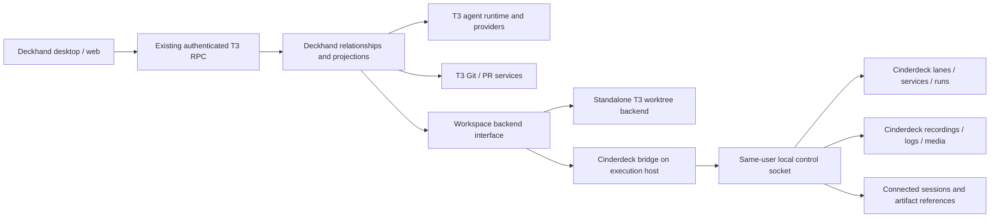

# Deckhand + Cinderdeck: full implementation plan

> Shipping direction updated 2026-10-04: Cinderdeck is one app in one repository. The harness is included under `agent-runtime/` and embedded in the Cinderdeck bundle. Historical instructions below about a separate Deckhand product/repository are superseded by [the unified build and maintenance workflow](UNIFIED_APP.md). Feature acceptance gates remain applicable; standalone harness tooling is for development and upstream maintenance.

Status: implementation plan; no harness integration has been implemented by this document.

Prepared October 2, 2026. This plan covers the complete product represented by the three approved concept screens, including production behavior, persistence, recovery, packaging, and validation. The early integration slice is a milestone, not the final deliverable.

Execution tracker: [implementation checklist](DECKHAND_IMPLEMENTATION_CHECKLIST.md). All implementation work is initially unchecked.

## 1. Product outcome

Build Deckhand as an independently usable, T3 Code-based coding-agent application. When connected to Cinderdeck, organize agent work around existing workspaces and lanes and make the associated pull requests, running services, task results, and recordings visible together.

The user must be able to:

1. Open a workspace and understand which features are active, which agents are working, which PRs exist, and what requires attention.
2. Create or select a lane, start an agent, send follow-ups, respond to questions/approvals, interrupt it, and resume the conversation later.
3. Open the lane's application, services, terminals, changes, PRs, and recordings without losing context.
4. Review a PR alongside evidence that identifies the code and environment actually tested.
5. Restart either application and recover relationships without creating duplicate agents, lanes, PRs, or recordings.
6. Use Deckhand without Cinderdeck, with its ordinary upstream project, thread, worktree, terminal, and provider functionality.

### Approved visual references

- [Workspace overview](../output/deckhand-concepts-2026-10-02/01-workspace-overview.png): lane rows containing agents, PRs, recordings, services, and an activity inspector.
- [Lane agent session](../output/deckhand-concepts-2026-10-02/02-lane-agent-session.png): conversation beside preview/diff/terminal/recording panels.
- [PR verification](../output/deckhand-concepts-2026-10-02/03-pr-verification.png): revision status, recorded verification, synchronized logs, and contributor history.
- [Image-generation prompts](../output/deckhand-concepts-2026-10-02/prompts.md): design intent and illustrative content.

Use these as composition and hierarchy references. Their sample names, numbers, icons, timestamps, ports, and statuses are fictional. Implement real controls, accessible typography, keyboard operation, and accurate states rather than copying raster artifacts literally.

## 2. Scope and decisions

### Included in the completed release

- A separately branded Deckhand desktop application and its local web interface, based on a pinned T3 Code revision.
- Independent operation plus optional integration with Cinderdeck on the same execution host.
- Workspace overview, lane hub, agent conversation, PR association/review, recordings, services, runs, activity, inbox, settings, and onboarding.
- First-class managed Codex and Claude Code sessions, including real lifecycle, approval, question, interruption, reconnection, and resume behavior.
- Multiple sessions per lane; coordinated writer ownership; supported external-session registration.
- Multiple repositories and PRs per lane, explicit relationships, and reliable repository identity.
- Real recording start/stop/playback, synchronized logs, evidence preparation, revision matching, and handoff to an agent.
- Connected-context visibility and navigation back into Deckhand from native Cinderdeck.
- CLI/MCP contracts, skills, documentation, migrations, diagnostics, release packaging, and upstream maintenance automation.

### Release boundary

The first distributed connected product targets macOS, where Cinderdeck runs. The exact supported OS range is the intersection of the pinned Electron runtime, provider CLIs, and Cinderdeck; verify this during bootstrap rather than promising Cinderdeck's current minimum for Deckhand.

Retain upstream standalone functionality for other platforms and provider adapters. Codex and Claude Code must pass the complete connected workflow before release. Each additional provider exposes a tested capability matrix; unsupported integration actions are disabled with an explanation. Presence in an upstream adapter registry is not proof of equivalent behavior.

Preserve the upstream environment boundary for browser and remote clients. A remote client accesses Cinderdeck on the agent's execution host, never the viewer's local Mac. Existing upstream mobile clients remain protocol-compatible where supported; shipping separately branded native mobile apps, a hosted relay, hosted accounts, billing, and hosted collaboration is outside this release. Do not present unimplemented mobile integration as shipped.

A SwiftUI rewrite of the harness, autonomous bug-hunting, competing-fix tournaments, and database cloning are separate later projects. They are not required to finish the approved three-screen product.

### Decisions made now

| Decision | Choice | Reason / tradeoff |
| --- | --- | --- |
| Base | T3 Code fork, initially pinned to the inspected revision | Reuse provider execution, conversations, terminals, preview, Git, and PR infrastructure; accept ongoing upstream maintenance |
| Product boundary | Separate Deckhand application | Preserves independent usability and avoids porting the entire React/Electron interface into SwiftUI |
| Runtime ownership | Cinderdeck owns connected lanes and operational resources | Prevents two worktree/process managers from competing |
| Integration location | Deckhand environment/server adapter | Keeps filesystem and provider operations on their owning host |
| Relationships | Explicit persisted identifiers, with suggestions from discovery | More implementation than branch-name matching, but handles forks, renames, multiple repositories, and historical evidence |
| Agent concurrency | One managed writer per physical checkout; reviewers are read-only or isolated | Preserves useful parallelism without uncontrolled concurrent edits |
| Evidence | Immutable captured provenance, mutable association metadata | Reattaching a recording cannot rewrite what it tested |
| Cloud dependencies | No inherited T3 cloud account, relay, telemetry destination, or updater requirement | Requires branding/configuration work and keeps the standalone product under our control |

## 3. Inspection baseline and reusable code

Inspected T3 revision: `4f7760e6a0037b06917adaae1b8a220e3ee6e5cc`.

Inspected Cinderdeck Git HEAD: `d838773a9bbca82732abbe5f9c5739f1693294ad`, plus an actively changing working tree. Workspace discovery/onboarding and updater work are already present as unrelated local edits. Treat those as in-progress work owned elsewhere; implementation must start in separate repositories/worktrees and reconcile current main before touching overlapping files.

The T3 inspection clone is `/tmp/cinderdeck-harness-study.DXNmgZ/t3code`. It is a research checkout, not a permanent product repository. No T3 build or runtime acceptance test was performed during this planning pass.

### Existing foundations and gaps

| Area | Existing foundation | Work required |
| --- | --- | --- |
| Agent runtime | T3 provider adapters, sessions, events, conversations, approvals, recovery | Bind sessions to features/checkouts and project normalized status into overview/inbox |
| Panels | T3 preview, terminal, files, diffs, device and PR panel descriptors | Add lane context and Cinderdeck recordings/services/run panels |
| PRs | T3 persistent multi-PR links and provider-backed reads; Cinderdeck native PR browser | Add lane/feature associations, commit-aware evidence, and native projections |
| Lanes | Cinderdeck create/adopt/update/release/remove, stable record IDs, worktree ownership and port allocation | Route every connected worktree mutation through one backend; add session reservations |
| Services/runs | Cinderdeck supervisor, tasks/workflows, durable run UUIDs, logs, readiness and cancellation | Surface them in Deckhand with scoped actions and provenance |
| Recording | Screen/window/CDP capture, `.log`, marks, snapshots, exports, frames and handoff bundles | Persist primary context, import preview video, deliver media safely, and verify revision relationships |
| Local transport | Same-user Unix socket, newline JSON, bounded frames | Version/capability handshake, durable operation receipts, resumable integration events, agent/artifact registry |
| Activity | Existing `events` method returns a bounded service-event tail | Add durable cursors and integration resource changes; do not treat the existing tail as a replay stream |
| Identity | Agent name/session, claims, lane IDs, workspace IDs | Separate connection health, live execution, and advisory ownership; persist generation-aware workspace bindings |

Primary source references:

- [T3 architecture](https://github.com/pingdotgg/t3code/blob/4f7760e6a0037b06917adaae1b8a220e3ee6e5cc/docs/internals/overview.md)
- [T3 provider constraints](https://github.com/pingdotgg/t3code/blob/4f7760e6a0037b06917adaae1b8a220e3ee6e5cc/docs/internals/providers.md)
- [T3 panel model](https://github.com/pingdotgg/t3code/blob/4f7760e6a0037b06917adaae1b8a220e3ee6e5cc/apps/web/src/rightPanelStore.ts)
- [T3 license](https://github.com/pingdotgg/t3code/blob/4f7760e6a0037b06917adaae1b8a220e3ee6e5cc/LICENSE)
- [Cinderdeck workspace behavior](WORKSPACES.md), [recordings](REPROS.md), [lane validation](LANES_VALIDATION.md), and [PR behavior](PULL_REQUESTS.md).

## 4. Architecture and ownership



### Sources of truth

| Entity | Authoritative owner | Other application's copy |
| --- | --- | --- |
| Provider credentials/session/transcript/turn | T3 runtime inside Deckhand | Cinderdeck receives bounded display metadata and links only |
| Connected workspace definition/lane/worktree ownership/ports | Cinderdeck | Deckhand caches a revisioned projection |
| Standalone project/worktree | T3 backend | No Cinderdeck resource until explicit adoption |
| Service process and task/workflow result | Cinderdeck | Read model and action references |
| Feature objective and session membership | Deckhand | Optional summary projection for native navigation |
| PR state/review/checks | Hosting service | T3-backed cache plus identified Cinderdeck projection |
| PR-to-feature/lane/session relationship | Deckhand relationship store | Explicit mirrored references in Cinderdeck |
| Captured video/logs/provenance | Cinderdeck; or upstream preview before import | Stable resource references and cached derived previews |
| Agent lease | Cinderdeck for connected operational actions | Deckhand displays it; lease is not agent runtime status |

Deckhand must not directly edit Cinderdeck TOML, lane manifests, recording metadata, or databases. Use versioned contracts. Cinderdeck must not parse provider transcripts or infer session state by inspecting process names. Share metadata without sharing mutable storage ownership.

## 5. Repository and fork strategy

Create a separate permanent `Deckhand` repository from T3, preserving upstream history and MIT notices. Keep Cinderdeck integration work in an isolated Cinderdeck worktree. Do not embed a second Git repository inside Cinderdeck.

Proposed structure within the fork; new locations are deliberately marked as proposed:

```text
packages/deckhand-contracts/              # proposed: shared typed integration/domain contracts
packages/deckhand-client/                 # proposed: same-host Cinderdeck client and fixtures
apps/server/src/deckhand/                 # proposed: relationships, workspace backend, projections
apps/web/src/deckhand/                    # proposed: overview, lane hub, evidence and inbox UI
packages/client-runtime/src/deckhand/     # proposed: shared client subscriptions and selectors
docs/deckhand/                            # proposed: product, integration and operator documentation
scripts/deckhand/                         # proposed: upstream audit and integrated acceptance runner
```

Use the upstream schema, Effect, persistence, transport, component, and test conventions rather than introducing a competing state-management stack. Reuse the existing RPC server and connection runtime.

Maintain `upstream-patches.json`: each modified upstream file, why it changes, its owning feature, its focused tests, and how to resolve future conflicts. CI rejects new modifications outside this manifest or Deckhand-owned folders. Start with explicit integration points and keep their count measured; the earlier design's approximate patch count is not a current guarantee.

Required integration seams include navigation, project/context selection, thread creation, worktree creation/adoption/cleanup, provider lifecycle projection, PR link lifecycle, preview capture/export, right-panel registration, RPC capabilities, migrations, branding/settings, and packaging. Do not spread Cinderdeck checks across provider adapters and UI components.

An upstream-sync workflow periodically opens update PRs against a staging branch. Pin release builds to a tested revision; run contract, migration, provider, and connected-flow tests before promotion. Conflicts remain explicit review work. Never equate a textually clean merge with a compatible update. Test dependency and stored-event schema changes as well as UI conflicts.

Use distinct bundle IDs, app names, protocols, CLI aliases, support directories, database paths, updater feeds/keys, and diagnostics destinations. Audit T3 Connect/Clerk/passkeys/relay/analytics hooks; remove or disable vendor-specific services unless deliberately replaced. Audit third-party notices and branded assets. Do not automatically reuse a live T3 database or credentials store.

## 6. Domain model and persistence

Extend the existing Deckhand/T3 server database with namespaced tables and migrations. Reuse upstream threads, sessions, turns, provider instances, PR references, and event infrastructure where supported. Do not create duplicate transcript or agent-execution records just to populate the overview.

| Record | Essential fields / invariants |
| --- | --- |
| `IntegrationHost` | Deckhand environment ID; persistent Cinderdeck installation ID; channel; protocol/capabilities; observed runtime epoch; last verified connection |
| `WorkspaceBinding` | Stable Deckhand UUID; backend kind; execution environment; Cinderdeck workspace ID and binding generation or standalone project reference; authored metadata revision; display name |
| `CheckoutBinding` | Stable UUID; workspace binding; kind `primary` or `lane`; opaque Cinderdeck lane ID if present; resolved repositories/worktrees; backend ownership; lifecycle state |
| `Feature` | Stable UUID; user-facing title/objective; primary workspace; status; timestamps; optional external issue references |
| `FeatureCheckoutLink` | Feature/checkouts many-to-many; one primary checkout for default actions; explicit cross-workspace participation |
| `SessionBinding` | Upstream thread/session references, provider instance, feature, checkout, repository scope, role, desired access, registered capabilities; retain history across restarts |
| `PullRequestLink` | Hosting provider/host, repository identity, PR number/native ID, canonical URL, explicit or suggested relation, feature/checkout/session associations, observed head SHA and freshness |
| `RecordingLink` | Cinderdeck recording UUID, primary feature/checkout/session/run, additional captured-workspace scope, origin, recording state and media availability |
| `EvidenceManifest` | Schema version; immutable captured repository/environment/run identities; verification checks; capture timing; asset references and hashes; provenance quality |
| `EvidenceAssociation` | Recording/run to PR or feature; created by; time; basis; current freshness result; never mutates the captured manifest |
| `ActivityProjection` | Typed integration event, source and source event ID, entity references, observed/occurred times; deduplicated |
| `AttentionItem` | Stable actionable cause, entity, severity, freshness, resolve/snooze state; resolution tied to source event/state |
| `OperationReceipt` | Idempotency key, normalized argument hash, actor/context, resource generation, status, result/resource IDs, reconciliation state |

### Identity rules

- Branch names, display titles, paths, and provider names are attributes, not relationship keys.
- Resolve the Git common directory and worktree root on the execution host. Keep repository remote identity separate from physical checkout identity.
- Distinguish fork head repositories from PR base repositories and distinguish GitHub hosts/accounts.
- Connected primary checkouts remain valid working contexts; do not create a synthetic managed worktree just to display the main branch.
- Cinderdeck workspace filenames currently supply IDs. Add generation-aware integration bindings/tombstones so deleting a workspace and recreating that filename does not inherit historical sessions or evidence accidentally.
- Lane renames retain their record ID. Lane removal preserves historical references, marked unavailable, rather than erasing work history.
- One recording can capture several workspaces; that capture scope must not silently attach the recording as verification for every feature.
- Archiving a feature/thread and deleting a lane are separate operations with separate effects.

Index feature/workspace/checkouts, session runtime state, canonical PR identity, evidence revision, and event cursor. Paginate history; overview queries return bounded summaries without full transcripts or log payloads.

Use revision checks for concurrent metadata edits. Changes accepted from multiple clients are persisted before broadcasting. Relationship operations spanning upstream state and Cinderdeck use durable intents plus reconciliation; no cross-process transaction or exactly-once guarantee is assumed.

## 7. Integration protocol

Keep existing CLI/MCP/socket methods backward-compatible. Add a versioned integration namespace to the same local control service. The following names are proposed contracts, not current APIs.

| Method | Contract |
| --- | --- |
| `integration.hello` | Protocol versions, capabilities, installation/channel identity, runtime epoch, media/log limits, replay range; no provider/session launch side effects |
| `integration.snapshot` | A coherent integration projection and high-water cursor; filter by workspace/checkouts |
| `integration.events` | Bounded long-poll after opaque cursor; changed-resource events and next cursor; explicit `resync_required` on expired cursor |
| `integration.operation.submit` | Allowlisted mutation with idempotency key, argument hash, resource revisions and context; returns durable operation ID |
| `integration.operation.get` | Pending/running/succeeded/failed/unknown-outcome state and created resources |
| `integration.session.upsert` | Bounded, revisioned session metadata, owner/provider IDs, context, observed state, source capability and freshness |
| `integration.session.remove` | Remove live registration while retaining historical references; does not kill arbitrary external processes |
| `integration.links.upsert` | Versioned feature/PR/recording associations with canonical IDs and explicit association source |
| `integration.links.list` | Filtered associations for native Cinderdeck and recovery |
| `integration.resource.describe` | Resolve authorized recording asset IDs, MIME/size/hash/availability; never arbitrary filesystem reads |
| `integration.resource.read` | Bounded range reads by opaque resource ID for media/log transfer |
| `repro.external.begin` / `repro.external.finish` | Register supported preview capture, clock mapping, workspace logs and finalized media through a validated import flow |

Example handshake shape:

```json
{
  "protocol": 1,
  "installationId": "opaque-installation-id",
  "channel": "release",
  "runtimeEpoch": "opaque-launch-id",
  "capabilities": ["integration.events.v1", "integration.operations.v1", "integration.sessions.v1", "repro.provenance.v1"],
  "limits": {"maxFrameBytes": 4194304, "maxReadBytes": 262144},
  "cursor": "opaque-cursor"
}
```

### Transport, event consistency, and recovery

Preserve the existing same-user Unix-socket permissions and peer validation. Discover the configured socket through the documented path/discovery behavior; do not assume the normal pathname when overrides or short-path fallback are in use. Validate installation ID and channel to avoid connecting a release session to an unrelated Debug fixture.

Use separate pooled command connections and a cancellable long-poll connection, because the current server processes a connection's requests sequentially. A pending event request must not block Stop or approval actions. Deckhand forwards normalized events over existing authenticated T3 subscriptions.

Introduce a Cinderdeck integration projection and durable event journal updated through a serialized publication boundary. Snapshot data and its high-water cursor are read atomically from that projection. Reconcile the projection from authoritative lane/run/repro/service stores after app restart. Emit tombstones and generation changes. If source changes cannot be published atomically with their file write, startup reconciliation must discover and publish them; never claim a distributed transaction.

Events carry source identity, unique event ID, sequence/cursor, entity generation/revision, event type, occurred/observed times, and a bounded payload. Replay preserves ordering within the source journal. Deduplicate events, tolerate repeated deliveries, and never replay destructive commands as a result of reconnecting a subscriber.

Start with configurable journal retention and explicit minimum/maximum replay cursors. A consumer that falls behind performs a fresh snapshot and resumes after its high-water cursor. Do not silently skip a gap. Bound buffers, batch high-volume output, and keep raw logs outside the metadata event journal.

### Mutation semantics

Every integration mutation has an idempotency key and a stable argument hash. Reusing a key with different input returns a conflict. Persist intent before side effects and resource IDs/results afterward. Retrying the same request retrieves the original operation.

Filesystem/process/network effects require operation-specific reconciliation. For example, lane creation records the operation key in its manifest; run submission persists the key with the run; recording start reserves its ID before capture. If interruption leaves an uncertain result, inspect those identities before retrying. PR creation checks hosting state and stored relationships before another create. Uncertainty remains visible until reconciled.

Use explicit errors such as `unsupported_capability`, `stale_revision`, `claim_conflict`, `busy`, `resource_missing`, `resync_required`, and `unknown_outcome`. Preserve existing human-control and claim rules. Cancellation is confirmed only after the authoritative owner reports it.

### Resource transfer

Do not send video through ordinary 4 MiB control frames or expose arbitrary paths to a browser client. Resolve opaque recording assets on the owning host, stream bounded chunks/ranges through the Deckhand server, and serve authenticated range-enabled media responses to its clients. Validate canonical roots/symlinks and deny unrelated files. Cache immutable assets by hash; revoke session access when its authorization changes. A remote client never tries to open the host's path as a local file.

## 8. Workspace backend and lane lifecycle

Introduce a `WorkspaceBackend` interface for inventory, create/adopt, inspect, setup, context resolution, reservation, release, and removal. The standalone implementation delegates to existing T3 behavior; the connected implementation delegates to Cinderdeck. Route UI, CLI/MCP, agent tools, thread archive cleanup, Git actions, and background settlement through the same choice.

Audit every upstream Git mutation path, including PR checkout, branch switch, pull/rebase/reset, checkpoint restore, worktree setup and automatic cleanup. Before an application-managed mutation in a connected checkout, acquire the same checkout reservation and run Cinderdeck's active-run/ownership preflight. Checkpoint restoration must coordinate filesystem state with provider conversation state and refuse unsupported provider rollback before changing files. Direct user/external edits cannot be prevented by advisory reservations; detect them, invalidate affected evidence, and surface conflicts. Never describe this coordination as filesystem sandbox enforcement.

### Create a connected lane

1. Select workspace, feature title, base revision, repositories and provider. Show the backend and whether setup/services will run.
2. Persist operation intent and feature/context reservation.
3. Ask Cinderdeck to create the lane; wait for the operation's actual result.
4. Resolve actual worktree roots, branch/head, per-service URLs/ports and setup outcome.
5. Bind the upstream project/thread to the returned checkout without creating a second worktree.
6. Acquire writer reservation and start the agent in the selected repository root with Cinderdeck context/tools.
7. Surface partial setup/provider failures while preserving the recoverable lane and feature record.

Adoption is explicit and preserves external ownership. Never automatically delete an adopted worktree. A multi-repository lane stores each resolved path and branch, and the agent's working directory must identify its intended repository. A service's shared-mode dependencies remain owned by their original checkout.

Deletion shows affected managed worktrees, copied/ignored files, active agent sessions, runs, services and shared users. Use Cinderdeck's existing dirty-worktree and teardown protections. Archive/settle does not automatically delete code. All T3 cleanup paths must recognize externally owned worktrees and delegate connected cleanup. Provider processes and terminals are stopped only through their owning runtime.

If Cinderdeck disconnects, freeze new connected lifecycle/service/recording mutations. An already running agent may continue according to its known runtime policy, but its operational context is labeled stale. Do not silently create a standalone replacement for the same connected lane. Reconnect reconciles state before enabling mutations again.

Standalone-to-connected transition explicitly adopts eligible worktrees, previews conflicts, preserves thread IDs, and stores an ownership transition receipt. Connected-to-standalone requires stopped work, a deliberate Cinderdeck release retaining files, and updated backend ownership; disconnecting the socket alone never changes ownership.

## 9. Agent sessions, concurrency, and attribution

Use existing T3 provider adapters and native authentication flows. Keep provider credentials on the execution host and outside Cinderdeck metadata, recordings, and diagnostics.

Represent three independent dimensions:

- **Execution:** queued, starting, working, waiting for input, waiting for approval, idle, finished turn, interrupted, failed, unknown.
- **Connection:** connected, reconnecting, unavailable, stale external registration.
- **Ownership:** writer, read-only reviewer, observer, released/conflicting reservation.

Derive execution from actual provider events and control responses. An expiring lease, a process existing, elapsed time, or a missing heartbeat cannot establish completion. Preserve upstream distinctions between provider turn completion and follow-up diff/checkpoint settlement. A completed turn does not automatically complete the feature.

Default to one managed writer per resolved physical checkout, across all workspace/lane aliases that point to it. Queue another writer or offer an isolated lane. Read-only review must use a provider-enforced mode where available; otherwise review immutable diff/artifact input or use a separate worktree. A prompt saying “do not edit” is not an enforcement mechanism. Cinderdeck claims are advisory coordination, not an OS security boundary; humans retain existing override controls.

Queued reviewer sessions start only when their declared input revision is ready. Record the reviewed commit/diff identity. Never present an agent's “0 findings” as a submitted GitHub approval. Provider switches preserve the upstream handoff behavior and make native resume versus summarized handoff explicit.

External sessions can register through a scoped CLI/MCP contract with provider/session identity, checkout, role, capabilities and event sequence. Registration grants visibility, not arbitrary control. Show unsupported transcript, Stop, resume or approval actions as unavailable. Heartbeat expiry produces “Connection lost” or “Last seen,” not “Finished.” Record the source of external status as reported, rather than claiming provider-authenticated provenance.

Track subagents as child sessions when the provider exposes stable IDs; otherwise show a bounded activity summary without invented separate sessions. Attribute actions to session IDs instead of a global “Codex” label.

## 10. PR association and review

Reuse T3's existing multiple-PR thread links, reverse lookup, hosting providers, auth, and cache. Add feature/checkout relationships without creating a second GitHub client stack inside Deckhand.

- PR creation from a managed session stores its explicit link immediately, including session, checkout, head repository/branch and initial commit.
- PRs created externally can be suggested using canonical host/repository, fork head identity and branch. Require explicit selection when ambiguous. A branch name alone is insufficient.
- A lane can have no PR, one PR, or several PRs across repositories. A PR can be linked to several collaborating sessions/features.
- Display fetched-at timestamps and distinguish cached status from confirmed current status. Batch reads, back off on rate limits, and avoid a poller per row.
- On push, force-push, PR head update or branch change, recompute evidence freshness. Do not rewrite historical manifests.
- Before submitting a review or another hosting mutation, recheck the account, permissions and expected head revision. Display results from the host; uncertain writes are reconciled rather than blindly repeated.
- PR merge/close and feature completion remain distinct. A merged PR can still have running agents or required follow-up work.

The native Cinderdeck PR window can display linked workspace/lane/session/recording references through the integration registry. GitHub remains authoritative for PR state; Deckhand's relationship metadata is authoritative for explicit links. The two applications should not repeatedly overwrite each other's cached status.

## 11. Recording, preview, and media lifecycle

Provide two recording paths with a common evidence contract:

1. **Cinderdeck capture:** reuse current screen/window/headless-CDP capture and its normal stop, frame, logs and export behavior.
2. **Deckhand preview capture:** reuse the upstream preview/browser capture capability where supported, then import finalized video into Cinderdeck through the new external-recording protocol. This path requires a real technical spike; source-level availability is not proof of export/clock compatibility.

Never assume that an embedded Electron preview exposes a safe compatible CDP endpoint. Select a supported existing capture adapter after testing. Preserve a fallback to Cinderdeck-owned Chromium or visible-window capture, with clear capture target and coverage.

External begin reserves recording ID and primary feature/checkout/session/run, selected log scope, expected capture target and a clock handshake. Persist monotonic capture timing and its mapping to the host's log timestamps, including pauses. Finalization validates media existence/codec/duration/hash, transfers it into an owned staging location, atomically publishes the recording, and marks failed or incomplete capture honestly. Abandoned begins become interrupted records with retained diagnostic evidence.

Inventory actual preview export containers/codecs during the spike. If a format is not playable through the supported Cinderdeck/Deckhand players, normalize a derived copy with an explicitly supported media pipeline and preserve the original plus timing metadata. Transcoding failure leaves an incomplete import with diagnostics; it cannot publish a success record. Apply size/duration quotas before expensive processing and report preparation progress.

Never import arbitrary agent-provided paths without validating ownership and location. Prefer scoped staging tokens/resource IDs. Active capture, export preparation, completed import, playback-ready, missing media, and failed finalization are distinct states.

The lane recording library includes manual links, recordings started by its sessions/runs, and clearly labeled suggested matches. Primary ownership is separate from additional workspaces whose logs were captured. Log-scope choices must persist through CLI, MCP, UI, library filtering, exports and replay.

Reuse frame extraction, existing handoff bundles, video files, marks and annotation infrastructure. Annotation metadata references recording ID, frame time, author and schema version; editing an annotation does not alter the original video/provenance. “Send evidence to agent” prepares a draft with selected video/frames/logs/diff and visible attachment state. A prepared path is not proof the provider accepted video; unsupported media gets an explicit fallback with the video retained in the handoff bundle.

## 12. Verification and revision matching

Persist an immutable evidence manifest containing:

- Primary feature/checkout/session/run and all participating workspace/repository IDs.
- Full repository commit IDs, branch names, base commit where relevant, and dirty-state classification at start and end.
- A content fingerprint for included uncommitted tracked changes and relevant untracked source/fixture files; never collect arbitrary ignored secrets.
- Definition revision, task/workflow definition snapshot, commands as already recorded, selected non-secret environment provenance, dependencies/fixtures identifiers where available.
- Service process/build identities and available build/source stamps, readiness and recording target.
- Actual run/check results, issuer, timestamps, skipped checks, errors, truncated/dropped logs, missing assets, and capture clock quality.
- Asset identifiers, sizes, checksums, and export schema version.

Evidence labels must mean exactly what they claim:

| Label | Required basis |
| --- | --- |
| Recorded | Playable capture exists; no correctness claim |
| No errors observed | No observed error signal within the captured scope; not a test pass |
| Checks passed | Named executed checks/runs succeeded; show skipped/unknown checks separately |
| Checkout matches PR | Clean captured repository commit equals current PR head; says nothing by itself about the served build |
| Verification matches this commit | Required checks passed against the pinned revision, tracked inputs remained stable, and the executed build/source provenance is established |
| Working-tree snapshot | Uncommitted content was tested; identify the captured fingerprint, not just HEAD |
| Earlier revision | Current PR head differs from captured provenance |
| Incomplete / unknown | Missing media, changing inputs, unavailable head, uncertain source/build, truncated critical evidence, or unsupported checks prevent the stronger claim |

Full-confidence verification runs acquire a checkout reservation or use an isolated verification checkout pinned to the PR head. Prevent managed writes during the test/capture interval. Check start/end state and source/build stamp; when external edits or uncertain hot reload prevent a stable claim, downgrade the label. A matching Git HEAD alone cannot prove a running server served that code.

Capture multi-repository revision sets. Updating a backend repository or fixture can invalidate an integrated verification even when the frontend PR SHA is unchanged. Link validity and verification success are separate fields. A failed check on the current revision remains useful evidence, not a passing verification.

Agent-authored check marks remain distinguishable from deterministic task/test results and human review. “Before”/“After” comparison requires explicit scenario linkage and compatible context; choosing two videos does not prove they exercise the same behavior.

## 13. Interface implementation

### Workspace overview

Build real responsive components from the approved first image. Sidebar: overview, inbox, workspaces, nested lanes, settings and connection state. Main view: scoped lane rows with feature title/branch, sessions and actual state, all PRs, meaningful recording previews, service summary and attention. Inspector: selected lane actions, authoritative activity, verification state and context.

Allow sorting/filtering by activity, attention, lifecycle, provider and search. Separate active sessions from historical contributors. Empty states offer concrete create/connect/adopt actions. Missing auth, offline host, incompatible Cinderdeck, invalid definition and stale status each have a specific state. No fake counters or permanently green connection indicators.

### Lane hub and agent session

Implement Overview, Agents, Pull requests, Recordings, Services, Runs, and Settings as views of one stable checkout context. Reuse T3's chat/composer, approvals, attachment handling and side-panel implementation. Add scoped context selectors and badges instead of cloning chat functionality.

Agent tabs carry provider/session/role/status; selecting another session changes only the conversation selection. Preview, terminal and diff panels resolve their owning checkout explicitly. A terminal is a shell in the chosen repository; a service log is the output of a Cinderdeck-owned process. Label those surfaces clearly.

Retain drafts, selected panels, tab order, scroll positions, and browser target across navigation. Switching lanes must never retarget an already-running command, attach the old lane's files to a new prompt, or send a follow-up to the wrong session. Display pending context changes before submission.

Services and Runs are complete operational views: service start/stop/restart and readiness/failure details, dependency navigation, command/log inspection, task/workflow selection, current progress, cancellation, completed step results, bounded log search, rerun using the current definition, and recording a selected run. Definition editing delegates to the existing validated Cinderdeck control APIs and respects stale revisions and required stopped-state checks. Primary and shared service ownership is visible before actions.

### PR verification

Use the third image's composition: hosting status and expected revision, evidence player, event timeline, synchronized source-filtered logs, contributor sessions and recording list. Playhead/log seeking works both directions with bounded rendering. Show unknown/older/dirty evidence prominently. Keep “Ready for review,” named checks, and actual submitted review decisions separate.

### Inbox and native Cinderdeck

Inbox aggregates actual approval/input requests, failed runs, connection failures, review-ready work and explicit verification problems. Selecting an item opens the correct context. Answered approvals disappear through authoritative events; snoozing does not approve or cancel work.

Add a native workspace/lane “Agents & linked work” surface in Cinderdeck containing session status, PR references and recording links, plus “Open in Deckhand.” Extend relevant PR/recording inspectors with their connected context. Do not make Deckhand necessary to use current Cinderdeck services, history or capture tools.

Deep links use validated opaque IDs and host/context identity, resolve locally, and handle missing/archived resources. Navigation links do not execute commands or submit prompts. Preserve existing `cinderdeck://` compatibility; register a separate Deckhand scheme.

### Visual and accessibility requirements

Use Cinderdeck's charcoal/ember tokens as the shared direction, with matching light mode and real provider assets where licensed. Match spacing and hierarchy without excessive nested cards. Support keyboard-only navigation, accessible names, visible focus, text scaling, reduced motion, high contrast, and non-color state indicators. Test full-width desktop and narrow local-web layouts; collapse inspectors/panels without losing access to controls.

## 14. Settings, onboarding, and recovery UX

First launch offers standalone project setup or connect to Cinderdeck. Discover the same-host app, verify identity/capabilities, choose workspaces and explain which system owns their lanes. Do not import a workspace by starting its services. Add provider setup using upstream auth; report missing, expired and unavailable states without launching auth as a health-check side effect.

Settings include workspace connection, provider/account selection, default writer/reviewer behavior, recording/log scope, retention, notifications, appearance, keyboard shortcuts, diagnostics, updates, and upstream version information. Unsupported options are hidden or explained through capabilities, not left as inert controls.

Recovery UI must expose pending operations and partial results: created lane but failed setup, running agent but lost bridge, completed capture still importing, successful local checks with stale PR state, or a provider that cannot resume. Offer retry/reconcile/open logs actions with the original operation identity. Restarting an app never automatically posts a PR/review, replays a user prompt, or discards checkout changes.

## 15. Security, privacy, and boundaries

Preserve upstream authentication/authorization for every RPC and subscription. A connected socket or a known resource ID alone is not authorization for all resources. Validate environment/project membership and client permissions on each command and media request.

Keep untrusted application content, logs, PR descriptions, and agent output as data. They cannot grant approvals or change workspace scope. Render Markdown/HTML through existing safe components. Approval answers are bound to provider instance, session, exact request and current turn; stale requests cannot grant broad access later.

Redact known secrets from operational exports; keep raw provider tokens, environment values, and filesystem paths that are not needed out of overview events and diagnostics. Diagnostics are bounded and opt-in where content-bearing. Exports visibly list included assets and scopes. Attaching to an external model follows the user's selected provider/action; no automatic uploading merely because a recording exists.

Sandbox preview content separately from privileged application APIs. Never expose a browser-debugging endpoint or Cinderdeck Unix socket directly to the network. Media endpoints use the same authorization model as their owning thread/workspace. External registrants cannot claim a managed session's identity or acquire process-control authority by supplying a PID.

## 16. CLI, MCP, and skills

Expose the same domain services through UI and agent interfaces. Extend Cinderdeck's single operation catalog so CLI and MCP schemas remain aligned. Add scoped operations for integration status, session registration/status, context links, evidence listing/preparation and operation reconciliation. Reuse existing lane/service/task/recording tools for their underlying work.

Deckhand tools resolve an explicit feature/checkout/session context, rather than trusting a display-name string. Mutations accept operation keys and appropriate revisions. Return bounded structured results, action status, created-resource IDs and freshness. Unknown arguments and unsupported capabilities fail clearly.

Update the canonical lane, recording and recording-review skills and their installed copies through the existing packaging mechanism. Include primary versus captured context, provider capability differences, actual session status, evidence freshness, video-inclusive handoff, and uncertain-operation recovery. Test help output, schema examples, client setup and installed skill contents against the real transports.

## 17. Performance and operational targets

These are acceptance budgets to measure, not claims about current performance. Establish a baseline on the development Mac and a less powerful supported Apple Silicon machine, with services and recording active.

| Scenario | Initial target |
| --- | --- |
| Warm overview with 100 workspaces / 500 lanes | Useful content within 1 second; no full-transcript fetch |
| Foreground local state change | Visible within 1 second under normal load |
| Local Stop action | Command dispatch begins within 250 ms; show actual termination progress separately |
| Lane switching with cached data | p95 below 200 ms excluding provider/network work |
| Video playback + active log ingestion | Responsive seeking and scrolling without main-thread log parsing |
| 30-minute event/log stress | Bounded queues/caches, no continued growth after load stops; report app and helper memory separately |
| Offline integrations | Backoff and stale indicators; no busy polling or automatic mutation retries |

Virtualize long lists/logs, subscribe only to visible/relevant scopes, throttle/coalesce high-frequency status changes, and avoid copying full buffers per event. Fetch video thumbnails lazily and cache derived assets. Use one hosted-PR refresh coordinator per environment/account with request deduplication and rate-limit awareness.

Measure cold/warm launch, event latency, reconnect recovery, export/import latency, frame/log alignment, CPU, memory, file descriptors, child processes and energy. Any failed budget gets a documented measurement and resolution before calling the release ready.

## 18. Implementation sequence and gates

All phases below are required for the defined release. Dependencies establish order; they are not permission to stop after the first useful slice. Each phase ships focused code, tests and documentation in reviewable changes across the two repositories.

| Phase | Deliverables | Dependencies | Completion gate |
| --- | --- | --- | --- |
| P0 — Fork baseline | Permanent fork, pinned revision, own app/storage identity, reproducible build, upstream patch manifest, fixture environment | None | Deckhand starts independently; no writes to live T3/Cinderdeck state; baseline provider session works |
| P1 — Contracts and persistence | IDs, capabilities, migrations, relationships, operation receipts, projection/event schemas and recorded fixtures | P0 | Old/new fixtures decode; migrations preserve data; retries/conflicts/generation changes tested |
| P2 — Cinderdeck bridge | Handshake, coherent snapshot/replay, operations, metadata registry, authorization and reconnect | P1 | Disconnect/restart/expired-cursor/uncertain-response scenarios reconcile without duplicate work |
| P3 — Checkout ownership | Backend interface; create/adopt/setup/release/remove; writer reservations; all cleanup paths routed | P2 | Three real parallel environments; correct directories/ports; adopted/shared/dirty paths preserved |
| P4 — Workspace overview | Real data-backed overview, sidebar hierarchy, inspector, filters, empty/error states and activity | P2–P3 | Approved screen represented with live fixtures; keyboard/AX and refresh/reconnect tests pass |
| P5 — Managed agent hub | Codex and Claude sessions, writer/reviewer queue, questions/approvals, Stop/resume, external registration, panel context | P3–P4 | Real provider lifecycle including failure and restart; correct attribution and no cross-lane actions |
| P6 — PR relationships | Persistent multi-PR linking, creation integration, external discovery/selection, hosting freshness/review, native link projection | P1, P5 | Fork/multi-repo/renamed branch/head-change/account-switch cases pass; links survive restarts |
| P7 — Recording integration | Capture-target spike, external import, clock mapping, authorized media, library, annotations and handoff | P2, P5 | Real playable video with aligned logs, pause/stop/import recovery, scope and video-handoff proof |
| P8 — Verification experience | Immutable provenance, isolated/pinned verification, PR freshness classification, player/timeline/logs and comparison | P6–P7 | Current/old/dirty/missing/changed-build evidence states are correct; real failed-then-fixed scenario |
| P9 — Complete product surfaces | Inbox, native Cinderdeck links, deep links, onboarding/settings, CLI/MCP/skills/help | P4–P8 | Every user-visible entry point reaches the same domain behavior and survives relaunch |
| P10 — Hardening and migration | Fault tests, performance/accessibility, existing-data migration, upgrade/downgrade and channel isolation | All functional phases | No blocking correctness/data-loss/security/UX defects; performance budgets and migration evidence recorded |
| P11 — Distribution and maintenance | Signed/notarized macOS builds, own updater, compatibility matrix, release notes, support bundle, upstream-sync rehearsal | P10 | Clean-machine install, actual update path, independent app operation and release artifacts verified |

### First complete integration slice

During P2–P5 prove this narrow path early: open one connected workspace, create one lane, launch one real Codex session in its actual worktree, show actual state in overview, interrupt/resume it, and recover after restarting both apps. Use the resulting evidence to correct contracts before building every screen. Continue through P11 afterward.

### File/module touchpoints

| Responsibility | Existing locations to reuse/extend |
| --- | --- |
| Cinderdeck integration transport/control | `Cinderdeck/Services/Stacks/Agents/StackControlSocket.swift`, `StackControlService.swift`, `StackControlProtocol.swift`; proposed `Cinderdeck/Services/Integration/` |
| Cinderdeck lane lifecycle | `Cinderdeck/Services/Stacks/Lanes/StackLaneCoordinator.swift`, `StackLaneStore.swift`, `StackLaneModels.swift`, membership/update controls |
| Workspaces and runs | `Cinderdeck/Services/Workspaces/WorkspaceControl.swift`, `WorkspaceRunner.swift`, `WorkspaceRunStore.swift`, `WorkspaceModels.swift` |
| Recording/provenance/import | `Cinderdeck/Services/Repro/ReproControl.swift`, `ReproRecorder.swift`, `ReproModels.swift`, `ReproStore.swift`, `ReproRecordingController.swift`, browser capture classes |
| Native linked context | `Cinderdeck/Features/Workspaces/WorkspaceView.swift`, `WorkspaceReprosView.swift`, `Cinderdeck/Features/PullRequests/`, `Cinderdeck/App/CinderdeckDeepLinkHandler.swift` |
| CLI/MCP/skills | `CinderdeckMCPServer.swift`, `AgentToolCLI.swift`, `StackAgentGuide.swift`, `StackAgentSkills.swift`, canonical `skills/` content |
| T3 execution/domain | `apps/server/src/orchestration-v2/`, especially provider adapters, event sink/store, effect worker, runtime recovery and turn controls |
| T3 checkout/PR behavior | `apps/server/src/git/GitManager.ts`, `GitWorkflowService.ts`, `apps/server/src/pullRequest/`, `apps/web/src/worktreeCleanup.ts`, worktree MCP toolkit |
| T3 UI | `apps/web/src/components/ChatView.tsx`, sidebar components, `rightPanelStore.ts`, PR components, existing preview/terminal surfaces |
| T3 capture | `apps/desktop/src/preview/`, `apps/server/src/preview/Manager.ts`, `packages/contracts/src/preview.ts` |
| T3 schema/storage | `packages/contracts/src/`, `packages/client-runtime/src/`, `apps/server/src/persistence/Migrations.ts` and migrations directory |

Recheck paths and applicable repository instructions at the actual implementation revision. New module names in this plan are proposed; existing files above were inspected or located in the current checkouts.

## 19. Test and acceptance matrix

Use unit/contract tests for domain invariants, real filesystem/process tests for lifecycle, transport tests for bridge behavior, and UI/end-to-end tests for the experience. Mocks alone cannot establish provider, recording, drag/drop, GitHub mutation or updater success.

| ID | Acceptance scenario | Required evidence |
| --- | --- | --- |
| A01 | Standalone Deckhand with Cinderdeck absent | Launch, real provider turn, terminal/diff/worktree behavior; no connection error blocking ordinary use |
| A02 | Three connected lanes run simultaneously | Actual Git roots/branches, non-conflicting ports, isolated task results and attribution |
| A03 | Two agents associated with one feature | Writer reservation, queued or genuinely read-only reviewer, individual status and history |
| A04 | Provider waits for input/approval | Exact request shown and answered; stale answer rejected; correct resumed session |
| A05 | Stop and resume | Provider confirmation, owned process behavior, retained transcript, no duplicate turn |
| A06 | Restart/disconnect during creation and work | Durable receipts, recovered associations, truthful unknown/disconnected states |
| A07 | Adopted/shared/dirty worktree cleanup | Retained external files/branches, protected changes, shared resource ownership; explicit removal outcomes |
| A08 | Multiple PRs and fork repositories | Correct host/head/base identities, deliberate links, reverse navigation and restart persistence |
| A09 | PR changes after recording | Earlier-revision label; old evidence preserved; fresh verification associated with new head |
| A10 | Dirty or changing checkout and stale served build | No false exact-commit verification badge |
| A11 | Multi-workspace recording | Included/excluded sources proven in stored metadata, actual logs, exports, list filters and playback |
| A12 | Failed then successful browser scenario | Playable before/after video, meaningful checks, aligned logs, correct scenario/revision linkage |
| A13 | Capture pause, abrupt stop, app crash, disk full | Partial/interrupted state; no false playable/pass claim; recoverable staged assets |
| A14 | Evidence handoff | Draft text plus actual selected assets; provider acceptance or explicit media fallback; video retained |
| A15 | Imported/external agent session | Last-seen/capability limits visible; no forged managed-process authority |
| A16 | CLI/MCP/native/web entry-point parity | Same validation, ownership, scope and resource result IDs |
| A17 | Auth/account/host changes | No stale credentials, cross-account review, or local-host resource substitution |
| A18 | Performance and accessibility | Measured fixture stress; keyboard/VoiceOver, light/dark, reduced motion and text scaling walkthrough |
| A19 | Existing-data migration and older peer | Data retained; missing capability disabled; replay/resync and downgrade handling |
| A20 | Install/update/uninstall | Signed release install, real update verification, app-specific data/feed identity and preserved unrelated app data |

Use controlled repositories/accounts for real PR create/review validation, and an isolated application data root for test runs. Tests must never point either application at the user's live stores. Keep real provider sessions small and record exact provider versions/capabilities. Unavailable external credentials make the relevant release check incomplete, not passed.

Build a fixture project with a frontend, API, shared dependency, deterministic declined-payment/retry scenario, test workflow, a second repository and noisy-log mode. It must produce both meaningful failures and verified success. Include unchanged and changed builds with identical apparent Git HEAD to test the provenance limitation.

Use existing Cinderdeck verification scripts/suites as the baseline, including workspace/lane agent controls and browser recording E2E. Add narrowly scoped new suites; follow T3's focused-check instructions. CI can run the agreed release matrix. When a suite fails, compare the untouched baseline before attributing the regression.

## 20. Migration, rollout, and release

New installs use Deckhand-owned data. Optional import from T3 is an explicit copy from a consistent read-only snapshot, with schema/version checks and a migration report; it never opens the live upstream database for writing. Provider-native session continuation is offered only when supported and verified. Preserve historical messages even if native resume is unavailable.

Cinderdeck migrations add integration records and optional recording provenance without rewriting existing workspace definitions or deleting historical captures. Existing recordings lacking sufficient provenance show legacy/unknown verification state. Reindex associations conservatively; do not invent PR links from matching titles.

Roll out through an isolated development build, internal alpha with selected workspaces, full acceptance pass, and signed release candidate. Feature flags are diagnostic rollout controls; the public full-release gate still requires every in-scope capability. Maintain a tested compatibility table for Deckhand/Cinderdeck integration protocol versions.

Take data backups before irreversible migrations. Older binaries must refuse newer incompatible stores with a clear recovery path rather than corrupting them. Rollback procedures identify which binary/store snapshot pairs are valid. Updater failure preserves the working installed version and produces diagnosable output.

Release evidence includes exact source commits, dependency locks, provider versions, OS/hardware, test results, videos of the core journeys, performance measurements, migration fixtures, code-signing/notarization results, update feed verification, known limitations and user-facing release notes. Release version/build numbers are chosen from the eventual fork's version line, not borrowed from T3 or Cinderdeck.

## 21. Risks, spikes, and decision points

| Risk | Early resolution | Revisit trigger |
| --- | --- | --- |
| Upstream changes cross many fork files | P0 patch inventory and P11 update rehearsal | Repeated conflict growth; seek a reusable extension seam |
| Preview video import cannot align clocks reliably | P7 real capture/import spike with timestamps and pause tests | Clock skew or lost events; use Cinderdeck-owned capture until resolved |
| Workspace aliases share a physical checkout | P3 canonical Git/worktree identity tests | New workspace modes or network filesystems |
| Provider claims exceed actual capabilities | P5 per-provider lifecycle suite | Provider CLI/version changes |
| Current code cannot prove served build revision | P8 pinned verification checkout/build stamp design | Hot reload and multi-repository scenarios |
| New integration journal becomes expensive | P2 bounded events and P10 stress benchmarks | Many concurrent clients or sustained log volume |
| Native Cinderdeck changes overlap active work | Separate worktree and rebase onto current accepted changes | Before each integration PR touching workspace/onboarding/update surfaces |
| Brand/cloud/auth assumptions leak from upstream | P0 distribution/settings audit | New upstream auth, relay or release-system dependencies |

Choose the smallest adapter that satisfies each gate. A failed spike must lead to an explicit revised design and acceptance criteria, not a placeholder button or an undocumented partial implementation.

## 22. Definition of complete

The implementation is complete only when all of the following are true:

- [ ] All three approved screens are implemented with real persisted data and working actions.
- [ ] Standalone Deckhand and connected Cinderdeck modes both work and preserve their ownership boundaries.
- [ ] Codex and Claude Code complete the real session lifecycle, with truthful status and provider-specific capabilities.
- [ ] Agents, PRs, recordings, runs and services remain correctly grouped after renames, restarts, disconnects and PR head changes.
- [ ] Connected worktree cleanup cannot bypass Cinderdeck ownership/dirty-state protections.
- [ ] Verification distinguishes execution results, observed errors, repository revision, working-tree content and actual build provenance.
- [ ] Video playback, synchronized logs, import recovery, annotations and evidence handoff are verified end to end.
- [ ] Native Cinderdeck references, deep links, inbox, onboarding, settings, CLI/MCP and installed skills are complete.
- [ ] Existing-data migrations, channel separation, unsupported peers and rollback behavior are tested.
- [ ] Required acceptance scenarios A01–A20 pass, with external/manual gaps explicitly resolved before release.
- [ ] Performance/accessibility gates and the upstream update rehearsal pass.
- [ ] Signed release artifacts, independent updater configuration, notices, documentation and release evidence are ready.

Completion is not established by a successful build, static screenshots, mocked status, or a single happy-path agent run. The final product must preserve the relationships and control behavior that make the approved design useful.
