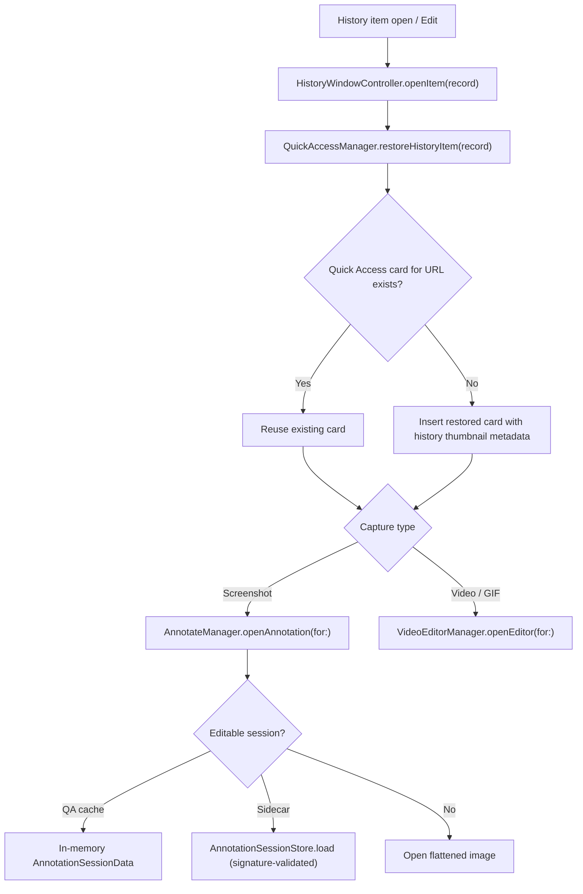

# Capture History

Workspaces now groups **Services, Tasks, Workflows, and Runs** in a dedicated window. Existing Stacks definitions and service controls remain compatible. See [WORKSPACES.md](WORKSPACES.md) for the task/workflow model, editors, lifecycle, and agent API.

Persistent history of screenshots, videos, and GIFs backed by GRDB SQLite, surfaced through a floating panel (compact carousel + expanded grid) and a restore-to-Quick-Access flow that reopens captures in Annotate or Video Editor with editable sessions. Code: `Cinderdeck/Features/History/` + `Cinderdeck/Services/History/`.

## Entry Points

- Status bar menu (Capture History).
- Deep link `cinderdeck://open/history` (aliases `history`, `capture-history`).
- Global shortcut `GlobalShortcutKind.history`, default ⌘⇧H (`ShortcutConfig.defaultHistory`), rebindable in Preferences → Shortcuts.

## Floating Panel

- `HistoryFloatingManager` — panel state. Modes `compact` / `expanded`; position `topCenter` / `bottomCenter` (`HistoryPanelPosition.center` exists for config import, not in UI); panel scale 0.8–1.4 (`history.floating.scale`); `maxDisplayedItems` default 10; background `HistoryBackgroundStyle` hud / solid; toggle-mode shortcut default ⌘E (`defaultToggleModeShortcut`); pin state `isPinned` (session-based, elevated window level `floating + 2`, suppresses auto-dismiss on blur).
- `HistoryFloatingPanel` keyboard: ⌘C copy selection, ⌘A select all, ⌘P toggle pin, ⌫ delete, Return open (all suppressed while text input active).
- Compact: type filter pills + horizontal `HistoryCompactCarouselView` cards + trailing controls (Open Full History, Pin, Close).
- Expanded: type pills + filename search (150ms debounce, `HistorySearchViewModel`) + time filters all / 24H / 7D / 30D (`HistoryFloatingTimeFilter`) + 4-column grid + multi-select + selection bar + custom `HistoryFloatingScrollbar` + trailing controls (Collapse, Pin, Close).

## Clipboard text

- The **Clipboard text** section is available in both compact and expanded history via the existing ⌘⇧H shortcut. The expanded view searches text, applies time filters, and shows the complete selected text beside the list. Copy buttons or ⌘C restore the exact plain text; Return copies and dismisses, arrow keys move selection, and Delete removes the selected text entry.
- Enable or pause collection in the panel or Settings → History → Save copied text. This is opt-in (`history.clipboardTextEnabled`, exported as `history.clipboard_text_enabled` in TOML). It records new copies while Cinderdeck runs; clipboard contents from before launch or while paused are not imported.
- `ClipboardTextHistoryStore` polls `NSPasteboard.changeCount` every 0.5 seconds, keeps exact Unicode/whitespace, and deduplicates repeated text by SHA-256, moving external recopies to the top. Copying from Cinderdeck history does not create a new record.
- Text stays in `clipboardTextRecord` in the local SQLite database (migration `v3_createClipboardTextRecords`), limited to 500 entries, 30 days, and 64 KiB per entry. Retention runs on insertion, launch, and hourly, independently of capture-file retention. Clipboard text is never included in diagnostic logs, cloud uploads, or configuration exports.
- Images, copied files, blank/oversized text, and clipboard content marked concealed, transient, or autogenerated by its source app are skipped. Ordinary web URLs and rich text with a plain-text representation are accepted. Apps must supply sensitive-content markers for that exclusion to apply.
- Settings → History → Clear Text History deletes stored text independently of captures and leaves the current clipboard unchanged. Individual entries can also be deleted from their context menu or expanded preview.

## Stacks

- **⌘⇧H → Stacks** groups arbitrary local project folders and start commands. **Create stack → Add project…** provides guided setup, with a TOML editor for dependencies, readiness, environment variables, and optional services.
- Compact cards provide Start/Stop, branch pickers, service state, and port links. **⌘E** opens repository controls, per-service controls, a bounded ANSI log console, and activity. **⌘P** pins either presentation.
- Sections persist as `history.selectedSection` (`captures`, `clipboard`, `stacks`); the previous `history.clipboardTextSelected` setting migrates once. Arrow navigation includes its section so clipboard and Stacks cannot act on one another's selection. Delete does nothing in Stacks.
- **⌘R** restarts the selected stack, **⌘⇧R** restarts the selected service, **⌘.** stops the stack, **⌘B** opens branches, and **⌘L** focuses logs. Editable text retains normal text shortcuts; read-only logs still support panel pin/expand and native text copying.
- Settings → History → Stacks controls availability, the definition folder, quit behavior, crash notifications, optional fetch, and Keychain secrets. Stacks does not launch user commands until Start is chosen.
- See [STACKS.md](STACKS.md) for the format, Git behavior, lifecycle, storage, and troubleshooting. Migrations `custom_v1_createStackRunRecords` and `custom_v2_createStackEventRecords` are appended after the existing history migrations.

## Capture card actions

- Context menu (`HistoryContextMenu`): Open in Finder, Copy, Edit, Upload to Cloud (only when `CloudManager.isConfigured`; live overlay states via `HistoryCloudUploadOverlayView`), Delete — destructive last.
- Double-click opens the editor; cards expose a Restore pill.
- Compact-carousel and expanded-grid cards also support native file drag-out. Dragging a card carries its existing screenshot, video, or GIF file directly to Finder, Messages, Mail, Notes, Slack, Discord, browser file-upload controls, editors, and other compatible drop targets. Single-click selection and double-click editor opening remain unchanged. When a scrollable list receives an unambiguous primary-axis mouse drag, the list keeps scrolling; cross-axis or diagonal card movement starts the file drag.
- History drag is file-centric: apps that only accept inline pixel data may reject it, and cards whose source file is missing do not start a drag. History records and files remain in place after a successful drop.
- Cloud upload here is manual; commit `dd4ccd5` removed only the after-capture auto-upload preference option, not this surface.

## Restore Flow

- Sidecar package format and signature validation: see [ANNOTATE.md](ANNOTATE.md#session-sidecars).
- Restored saves follow the same Quick Access session behavior as fresh captures; already-saved files expose Open in the save/open slot.

## Storage

- Database: GRDB SQLite at `~/Library/Application Support/Cinderdeck/cinderdeck.db` via `DatabaseManager` (`Services/Cloud/`). Migrations: `v1_createCloudUploadRecords`, `v2_createCaptureHistoryRecords`. Launch repair/reset recovery archives db files to `DatabaseRecovery-<timestamp>/`.
- `CaptureHistoryStore` — GRDB `ValueObservation` publishes records; `add` is a no-op when `history.enabled` is off; `updateFilePath` (temp→export move), `markFileChanged`, `hasRecord(forFilePath:)`, `removeByFilePath`.
- Media files: temp captures live in Application Support temp root; saved captures in the user export folder — history only records paths.
- Thumbnails: `HistoryThumbnailGenerator` — JPEG, max dimension 208, stored in `HistoryThumbnails/`; `NSCache` memory cache 160 items / 48MB.

## Retention

- `CaptureHistoryRetentionService` — sweep at launch + every 24h timer.
- Prefs: `history.retentionDays` (default 30, 0 = forever), `history.maxCount` (default 500, 0 = unlimited).
- Sweep deletes: records older than retention, count-overflow records, unreferenced temp files, orphan thumbnails, orphan annotation sidecars (source gone / no active record / signature mismatch).
- `clearAllHistory()` deletes records + thumbnails + sidecars but keeps capture files on disk.
- `history.floating.autoClearDays` is persisted/exported but never consumed — dead setting.

## Temp File Interplay

- Launch `TempCaptureManager.cleanupOrphanedFiles` skips files referenced by active history records and keeps recent temp files while history is enabled (retention window); retention owns their eventual deletion.
- Quick Access dismiss deletes the temp file unless a history record exists or the general pasteboard still references it (`ClipboardHelper.isReferencedByGeneralPasteboard`, changeCount-matched); Quick Access delete removes the record first so the temp file actually goes away.

## Preferences Surface

Settings → History: enable toggle, floating panel (position, scale, max items, background, toggle-mode shortcut), display, retention days / max count, storage info. See [PREFERENCES.md](PREFERENCES.md).

## Dead / Legacy Code

Unused (kept in tree): `HistoryMainView` (except `HistoryBackdropView`, still used by the floating panel + preferences + cloud history), `HistoryItemView`, `HistoryToolbar`, `HistoryFilterBar`, `HistoryGridView`. Live card views are `HistoryCardView` / `HistoryExpandedCaptureCardView` / `HistoryCompactCarouselView`.

## Related docs

- [QUICK_ACCESS.md](QUICK_ACCESS.md) — restore target and card lifecycle
- [ANNOTATE.md](ANNOTATE.md) — editable session restore, sidecar format
- [VIDEO_EDITOR.md](VIDEO_EDITOR.md) — video/GIF restore target
- [POST_CAPTURE.md](POST_CAPTURE.md) — where history records are created
- [CLOUD.md](CLOUD.md) — upload records sharing `cinderdeck.db`
- [PREFERENCES.md](PREFERENCES.md) — settings keys
