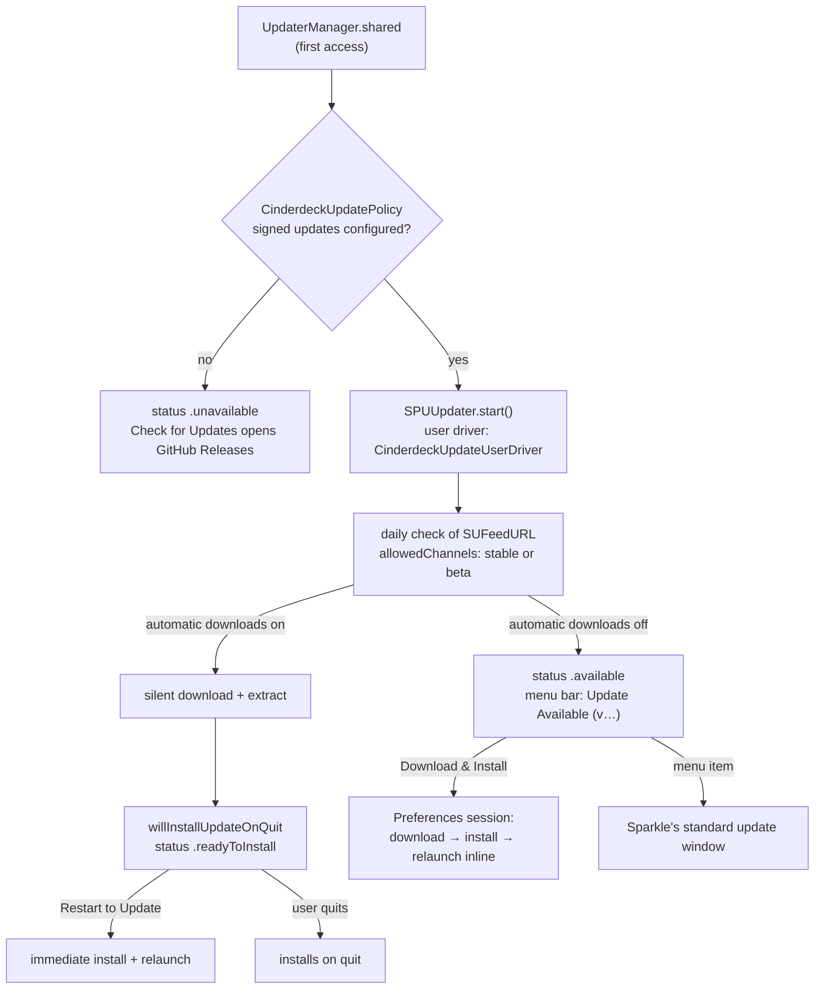
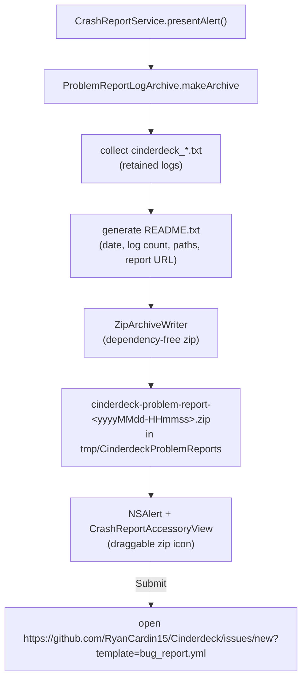

# Updates, Diagnostics & Problem Reporting

Sparkle-based app updates, local diagnostic logging, crash detection, and the manual problem-report bundle. No telemetry anywhere — logs stay on the user's Mac.

Verified against `Cinderdeck/Services/Updates/`, `Cinderdeck/Features/Preferences/Components/PreferencesSoftwareUpdateView.swift`, `Cinderdeck/Services/Diagnostics/`, `Cinderdeck/Features/CrashReport/`, `Cinderdeck/Resources/Info.plist`, and `appcast.xml`. Publishing and signing are in [RELEASES.md](RELEASES.md).

## Sparkle updates

Installed releases keep themselves current. By default Sparkle checks the feed daily (`SUEnableAutomaticChecks`), downloads a new version in the background (`SUAutomaticallyUpdate`), and installs it when Cinderdeck quits. Preferences and the menu bar offer to install it immediately.

### Components

- `UpdaterManager.shared` (`Cinderdeck/Services/Updates/UpdaterManager.swift`) owns the `SPUUpdater`, implements `SPUUpdaterDelegate` and the gentle-reminder parts of `SPUStandardUserDriverDelegate`, and publishes `status`, `canCheckForUpdates`, and `lastUpdateCheckDate` for SwiftUI. It logs the lifecycle in the `.update` category.
- `CinderdeckUpdateUserDriver` (`CinderdeckUpdateUserDriver.swift`) wraps `SPUStandardUserDriver`. Sessions started from Preferences (`PreferencesUpdateIntent.check` or `.install`) report progress to Preferences instead of opening Sparkle's windows: a check replies *dismiss* so Preferences can offer the update; an install replies *install* at each prompt because the user already chose it. Every other session (menu bar checks, scheduled alerts, permission and authorization prompts, informational and critical updates) uses Sparkle's standard windows. Every session reports its progress so Preferences and the menu bar stay current.
- `UpdateStatusMachine` (`UpdateStatus.swift`) folds Sparkle's events into one `UpdateStatus`: `unavailable`, `idle`, `checking`, `upToDate`, `available`, `downloading` (with progress), `extracting`, `readyToInstall`, `installing`, `failed`. It has no Sparkle types and is covered by `UpdateStatusMachineTests`.

### Entry points

- **Preferences → About** and **Preferences → General → Updates** show `PreferencesSoftwareUpdateView`: the current status with **Check for Updates**, **Download & Install** (or **View Release** for informational updates), **Cancel** during a check or download, **Restart to Update** once downloaded, **Quit and Install** if quitting was cancelled mid-install, and **Try Again** after a failure. General also has the automatic check/download toggles (downloads are disabled while checks are off) and Last Checked.
- The Preferences sidebar badge shows an arrow when an update is waiting; clicking it opens About and checks if nothing is pending.
- The menu bar's **Check for Updates…** item (hideable in Preferences → Menu Bar) becomes **Update Available (v…)…** (opens Sparkle's update window) or **Restart to Update** (installs now).
- Scheduled alerts: Sparkle shows its alert when it can come to the front (near launch) or for critical updates; otherwise the menu bar item and Preferences serve as the reminder, since an alert would open behind other apps (`supportsGentleScheduledUpdateReminders`).
- Silently downloaded updates: `willInstallUpdateOnQuit` hands over Sparkle's immediate-install handler, which **Restart to Update** calls; critical updates stay with Sparkle so it can present them. Quitting can be cancelled by Cinderdeck's running-work prompt (`StackQuitCoordinator`); the update still installs at the next quit.

### Configuration

- Feed: `SUFeedURL` = `https://raw.githubusercontent.com/RyanCardin15/Cinderdeck/main/appcast.xml`; archives are EdDSA signed and verified against `SUPublicEDKey` (written by `scripts/setup-release-signing.sh`).
- Channels: `UpdateChannel { stable, beta }` persisted under `updates.channel` (`PreferencesKeys.updateChannel`); `allowedChannels(for:)` returns `["beta"]` on beta, `[]` on stable. Stable items are untagged; beta items carry `<sparkle:channel>beta</sparkle:channel>`. Changing the channel checks again from Preferences.
- The installer runs in-process (no `SUEnableInstallerLauncherService`): Cinderdeck is not sandboxed, and Sparkle's launcher XPC service is only for sandboxed apps. The leftover `-spks`/`-spki` mach-lookup entitlements have no effect outside the sandbox.
- `CinderdeckUpdatePolicy.isConfigured` requires `CinderdeckSignedUpdatesEnabled`, the release bundle identifier (Debug builds never update), Cinderdeck's feed (or `scripts/test-update-local.sh`'s localhost feed), and a 32-byte key other than upstream Snapzy's.
- TOML sync: `[updates] check_automatically`, `download_automatically`, `channel` (see [CONFIGURATION.md](CONFIGURATION.md)).
- Testing: [UPDATE_TESTING.md](UPDATE_TESTING.md).

## Diagnostics

- `DiagnosticLogger` (`Cinderdeck/Services/Diagnostics/DiagnosticLogger.swift`): appends to daily files `~/Library/Logs/Cinderdeck/cinderdeck_yyyy-MM-dd.txt` on a serial queue (`com.ryancardin.cinderdeck.diagnosticlogger`), writes a session header per launch (`startSession()`), exposes `log(level:category:message:context:)` + `logError` helpers with source location capture.
- Levels (`DiagnosticLogLevel`): `DBG`, `INF`, `WRN`, `ERR`, `CRS`.
- 16 categories (`DiagnosticLogCategory`): SYSTEM, CAPTURE, RECORDING, EDITOR, ACTION, UI, LIFECYCLE, UPDATE, ANNOTATE, OCR, CLIPBOARD, EXPORT, PREFERENCES, CLOUD, HISTORY, FILE_ACCESS.
- Opt-in toggle `diagnostics.enabled`, default on; surfaced in onboarding (diagnostics step) and Settings → Advanced → Diagnostics.
- Retention: `LogCleanupScheduler` deletes files older than `diagnostics.retentionDays` — default 3 days, range 1–30 (clamped). Started/stopped by `AppCoordinator` (see [APP_LIFECYCLE.md](APP_LIFECYCLE.md)).
- Crash detection: `CrashSentinel` — UserDefaults flag `diagnostics.sessionActive`; `checkAndReset()` at launch reports whether the previous session ended abnormally, `markTerminated()` on clean quit. The flag feeds the (currently menu-unwired) crash prompt state in `AppStatusBarController`.
- Toasts: `AppToastManager` — global in-app toast notifications (config sync results, import notices, etc.).

## Problem reporting

- `CrashReportService.presentAlert()` (`Cinderdeck/Features/CrashReport/CrashReportService.swift`): builds the archive, shows an informational alert with a draggable zip accessory (`CrashReportAccessoryView`), Submit opens `https://github.com/RyanCardin15/Cinderdeck/issues/new?template=bug_report.yml`.
- Archive contents: `README.txt` (generated summary) + `diagnostic-logs/cinderdeck_*.txt` for every retained log; older archives in the temp folder are cleaned up on each build. `ZipArchiveWriter` is a local dependency-free zip implementation.
- Entry points:
  - Settings → About → **Report a Problem** (full alert + bundle).
  - Settings → General → Help → **Report Issue** (opens the bug-report page directly, no bundle).
  - Status bar: `AppStatusBarController.reportProblemAction` calls `CrashReportService.presentAlert()` but is **not wired into `buildMenu()`** — see Unresolved questions.
- Privacy: the zip is never sent automatically; the user attaches it manually on the report page.

## Unresolved questions

- `reportProblemAction` / `didDetectCrash` in `AppStatusBarController` exist but no menu item triggers them — dead code or pending status-bar "Report a Problem" item? (Also flagged in [APP_LIFECYCLE.md](APP_LIFECYCLE.md).)

## Related docs

- [APP_LIFECYCLE.md](APP_LIFECYCLE.md) — scheduler startup, CrashSentinel wiring, entitlements
- [PREFERENCES.md](PREFERENCES.md) — General/Advanced/About tab settings
- [RELEASES.md](RELEASES.md) — appcast publishing, signing
- [UPDATE_TESTING.md](UPDATE_TESTING.md) — testing the update flow
- [BUILD.md](BUILD.md) — build/version pipeline
- [CONFIGURATION.md](CONFIGURATION.md) — TOML sync of update/diagnostic prefs
