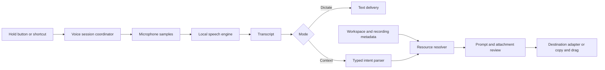

# Local voice input and context for Cinderdeck

Design proposal — October 1, 2026. This document describes proposed behavior; voice input has not been implemented or benchmarked in Cinderdeck.

## Recommendation

Build a global push-to-talk input feature with an optional Cinderdeck context mode. A small floating panel shows speech, the destination, and resolved context. The first useful experience is dictating into the app where the user is already writing, then attaching a recording or referring to a project folder without navigating away.

Use an existing on-device speech engine. Resolve resources through Cinderdeck's workspace and recording metadata. Introduce a local language model only if testing shows that flexible phrasing needs it; common attachment commands do not require one.

Start by comparing Apple's SpeechAnalyzer/SpeechTranscriber with Parakeet through FluidAudio on actual development workloads. Implement one winning backend first behind an interface. On this machine, macOS 26.3 and an M4 Max with 64 GB of memory make both candidates eligible for evaluation. Hardware eligibility is not proof of installed assets or measured performance.

## Experience

Provide a hold button and configurable global shortcut. A toggle shortcut offers the same feature without holding a key. Escape cancels. Audio capture begins only after explicit activation, and a visible indicator shows when the microphone is active.

Two modes have different expectations:

| Mode | On release | Example |
| --- | --- | --- |
| Dictate | Finalize and insert the transcript at the captured destination; copy if insertion is unavailable | “Fix the empty state in the recordings list.” |
| Prompt with context | Build an editable prompt with visible resource chips, then offer Insert, Copy, or Drag | “Fix the checkout issue. Cinderdeck, attach the latest recording from Shop, and use the frontend folder.” |

The mode is selected before speaking through the panel or a separately configured binding. Dictate always treats speech as text. Context commands use an explicit cue such as “Cinderdeck, attach…”. A wake word does not activate the microphone. Ambiguous speech remains visible rather than silently disappearing from the prompt.

For the context example, the review panel might show:

```text
Prompt with context                        Destination: Codex

Fix the checkout issue.

[Shop / current lane] [frontend / folder scope]
[Checkout failure · Today 10:42 · video + logs + frames + diffs]

Insert prompt       Copy files       Drag handoff       Cancel
```

These labels and times are illustrative. The actual panel displays resolved names, paths, recording times, and attachment contents. It makes partial delivery visible: text inserted and files prepared are separate outcomes.

Ordinary dictation should stay lightweight. The richer review panel appears for context requests, ambiguity, failed insertion, or an explicitly requested preview. Local punctuation and optional filler removal must preserve code identifiers, negation, constraints, and the original transcript.

## Existing integration points

The current checkout already contains the following building blocks:

| Existing component | What is reusable | What is new |
| --- | --- | --- |
| `Cinderdeck/Services/Shortcuts/KeyboardShortcutManager.swift` | Configurable global bindings, conflict handling, Fn matching, delegate dispatch | Press/release lifecycle for push-to-talk; current Carbon handler registers press only |
| `Cinderdeck/Features/Recording/MicrophoneAudioCapturer.swift` | Microphone selection, permissions, background capture queues, PCM sample delivery | Shared microphone ownership/fan-out and engine-specific sample conversion |
| `Cinderdeck/Features/Stacks/StacksViewModel.swift` | Selected workspace, lane selection, services, runtime state | A reusable context-selection provider independent of the view model |
| `Cinderdeck/Services/Stacks/Models/StackDefinition.swift` | Workspace IDs, repository roots, services, lane relationship | Scoped file metadata lookup and spoken aliases |
| `Cinderdeck/Services/Repro/ReproModels.swift` | Recording status, dates, workspace membership, markers, video location | Explicit voice query semantics and attachment validation |
| `Cinderdeck/Services/Repro/ReproStore.swift` | Saved recording discovery, newest-first ordering | Cached recording metadata index; avoid scanning the library on each utterance |
| `Cinderdeck/Services/Repro/ReproRecordingController.swift` | `ReproExport.handoff`, cached README/log/frame/diff bundle, original video reference | Prompt attachment assembly and cache preparation policy |
| `Cinderdeck/Features/Repro/ReproAgentDragCard.swift` | Actual file drag and Copy Files behavior including video | Unified prompt review and destination delivery |
| `Cinderdeck/Services/History/ClipboardTextHistoryStore.swift` | Opt-in clipboard history and transient/generated pasteboard exclusions | Coordinate temporary insertion clipboard writes with history and restoration |
| `Cinderdeck/Services/Stacks/Agents/StackControlProtocol.swift` | Local socket API and typed workspace snapshots | Optional resolve/prepare contracts for future clients |

The current active-window resolver resolves a screen capture target, not an editable text caret. Prompt delivery needs its own focused-element snapshot. No general external-app text injection or universal prompt composer was found in the inspected code.

## Speech engine choices

| Candidate | Fit | Constraint |
| --- | --- | --- |
| Apple SpeechAnalyzer + SpeechTranscriber | Native Swift integration, on-device transcription, partial/final results, system-managed language assets | macOS 26+; query hardware/locale support and asset readiness |
| Parakeet through FluidAudio | Swift/Core ML integration and Apple Neural Engine execution; useful when Cinderdeck should control model distribution | Current package requires macOS 14 and Swift tools 6.0; separate model download and lifecycle |
| WhisperKit | Alternative on-device Swift backend with multiple Whisper model sizes | Current documented prerequisites include macOS 14; measure suitability rather than selecting the smallest model for speed alone |
| whisper.cpp | Possible compatibility backend for Intel and older systems | C/C++ integration, distribution, and a separate performance/support burden |

For Parakeet, compare an established TDT v3 reference with the small English streaming EOU model. The maintainer also offers newer variants; select and pin the actual model after evaluating short prompts, technical vocabulary, punctuation, download footprint, and release-to-insert latency. TDT windowed processing and a native streaming model have different latency/accuracy behavior. Model throughput claims do not establish interactive latency.

Apple's speech model is local AI even though Cinderdeck does not ship the weights itself. Language assets still require an initial download. FluidAudio likewise can download models once, then load local assets in offline-only mode. Expose Downloading, Preparing, Ready, and Unavailable states; never hide a cloud transcription fallback.

Cinderdeck's deployment target is currently macOS 13. Availability checks handle Apple APIs compiled with a suitable SDK, but do not establish that a package with a higher deployment minimum can link into the existing target. Before adding FluidAudio or WhisperKit, either validate a compatible integration or place the dependency in a signed macOS 14+ helper target with structured IPC. Keeping the main app's current support policy is a separate decision from voice-backend support. A helper also offers optional memory/crash isolation, at the cost of signing and lifecycle complexity.

Check SDK and weight licenses independently for pinned versions. FluidAudio's SDK is Apache 2.0; NVIDIA's TDT v3 model card specifies CC BY 4.0. Preserve required attribution when redistributing weights. Avoid treating the SDK license as the license for every model.

## Architecture



Suggested boundaries:

- `VoiceSessionCoordinator` owns activation, cancellation, capture target, and the state machine: idle → preparing → listening → finalizing → reviewing/delivering → idle. Every session has a generation ID so late results cannot insert after cancellation.
- `SpeechTranscriptionEngine` exposes prepare, streamed input/results, finalize, and cancel. Its capabilities declare supported locales, vocabulary guidance, and input formats.
- `VoiceContextProvider` produces a small snapshot of the explicitly selected workspace/lane and allowed metadata. Selection is captured before the voice panel appears.
- `VoiceIntentParser` proposes allowed resource requests while preserving the raw transcript and the exact spans interpreted as command clauses.
- `VoiceResourceResolver` translates those requests into existing IDs and validated file URLs. It owns scope and ambiguity handling.
- `VoicePrompt` contains prompt text, original transcript, workspace/lane IDs, attachment descriptors, unresolved requests, and a destination snapshot.
- `VoiceDeliveryAdapter` declares capabilities for text, real file attachments, and resource references, then reports each delivered or pending item.

Represent resources with stable IDs: workspace ID, lane ID, recording UUID, and a repository-root ID plus relative path. An interpreter selects from candidates; it does not invent absolute paths. A destination snapshot includes application PID/bundle ID and, when available, the focused text element/window. Revalidate it immediately before insertion.

The microphone capturer currently has a single delegate. If recording and dictation run together, use a shared capture owner with sample subscribers or an explicitly tested independent-session strategy. Do not replace the recorder's delegate or restart its session. Capture emits 48 kHz PCM; conversion to the backend's format happens off the main actor with a proper converter. Parakeet commonly takes 16 kHz mono; Apple should negotiate its preferred input format.

## Context resolution

Resolve “this workspace” from an explicitly selected/pinned context. A target-app adapter may provide a verified project root that maps to a known workspace. The frontmost app name alone is insufficient, and a hidden stale selection should not silently choose a project. Show the resolved context chip, and ask in the panel if none is established.

| Spoken request | Resolution rule |
| --- | --- |
| “Use Shop” | Exact workspace name/ID or configured alias first; offer candidates for uncertain matches |
| “Use the auth lane” | Resolve within the chosen workspace, preserving the actual lane ID |
| “Use the frontend folder” | Match directory metadata inside the selected repository root; show the full path when names repeat |
| “Attach App.tsx” | Match an accessible file in the selected scope; prefer exact matches and require selection for duplicates |
| “Attach the latest recording” | Most recently ended saved, ready recording in the selected workspace/lane; exclude active/finalizing sessions |
| “Attach the recording I just made” | Resolve a known recently completed session ID; show its title and time |
| “Include the errors from that recording” | Resolve timestamped logs and selected frames from that session, preserving recorded scope |

“Latest” should have an explicit ordering: `endedAt`, falling back to `createdAt` for older records, then a stable ID tie-breaker. The existing store sorts by creation time, so the voice resolver must implement the intended end-time semantics. Failed recordings can still carry useful logs; expose that choice separately instead of silently attaching them when the request implies a video.

Parent-workspace and lane membership are not interchangeable. Resolve the requested lane through current lane metadata and match recording IDs precisely. Broader parent-workspace results must visibly identify their lane. A recording may include multiple workspaces; show all captured workspaces, and do not label a multi-workspace video as containing only the requested one. Preparing a handoff reuses recorded scope rather than collecting unrelated live logs.

A folder reference establishes scope and a readable path/manifest. It does not recursively upload the directory. Actual files are separate attachment items. Index names, relative paths, types, and modification times in selected roots; skip large generated directories and respect project exclusions. Read contents only when needed for a selected file. Validate canonical roots, symlinks, existence, and readable access before delivery.

Workspace names, lane aliases, service names, and selected filenames can form a bounded technical vocabulary. Apply guidance only through supported backend capabilities. FluidAudio documents CTC vocabulary boosting, which can require a separate encoder and extra memory; it is an optional measured enhancement. Conservative correction is safer than replacing every similar sounding identifier.

## Interpretation without a large model dependency

The initial parser handles a small set of explicit operations: select workspace/lane, select folder scope, attach file, attach latest/specified recording, and include recording evidence. It returns typed requests plus transcript spans. It does not execute shell commands or change services while composing a prompt.

This can be implemented with deterministic patterns and scoped name resolution. More flexible phrases can later use an optional local language model to produce the same typed plan. On supported macOS 26 configurations, Apple's Foundation Models framework offers on-device generation and structured output; check `SystemLanguageModel.default.availability`, since Apple Intelligence eligibility/enabling and model readiness are independent constraints.

Constrained output improves format reliability, not semantic correctness. Validate every proposed ID and operation against current candidates, distinguish dictated requests from explicit context commands, and show ambiguity. File contents and logs are evidence, not instructions to the interpreter. Plain dictation stays available if the interpreter is unavailable or slow.

## Delivery into other apps

For supported editable fields, insert the final transcript through a destination adapter or a carefully scoped accessibility/paste operation. Capture the destination before showing the panel, preserve selection where possible, avoid secure fields, and stop automatic insertion if the target changes. Terminals need a verified agent-input adapter or a copy/drag workflow; generic multiline paste can trigger shell behavior even without an extra Return key.

Actual attachments are a separate contract. Some apps accept file URLs from a pasteboard, some support drag/drop only, and some interpret paths as text. Existing Cinderdeck Copy Files/drag behavior provides a practical fallback, but does not prove automatic mixed text-and-file delivery in every app. Unknown destinations get distinct Insert/Copy Text and Copy Files/Drag actions. Supported adapters can later combine them after end-to-end validation.

When attaching a recording, reuse `ReproExport.handoff` and include its video URL plus README, timestamped logs, frames, and diffs where present. Show the primary video and its size. If the destination rejects video, expose evidence-only delivery with an explicit missing-video status. A filesystem path is useful to a local coding agent, but is not proof that a remote chat can access the file.

Use direct draft insertion for Cinderdeck-owned UI. A future Deckhand integration can receive a typed prompt/attachment draft through a versioned local API; Cinderdeck continues to own voice/resource preparation and Deckhand remains independently usable. That adapter is proposed, not a current integration in this checkout. Avoid submitting a prompt as a side effect of dictation or attachment preparation.

Temporary pasteboard insertion should tag generated/transient content so Cinderdeck's opt-in clipboard history does not unexpectedly retain it. Preserve supported prior pasteboard representations and restore only after verified consumption and if no other process has changed the pasteboard. Unknown consumers may need the content retained; never restore on an arbitrary short timer that breaks delayed attachment reads.

## Local operation and performance

Keep voice audio in memory by default. Delete temporary audio on completion/cancel. Store transcript history only through an explicit preference; diagnostics record durations and error categories rather than speech or file contents. Speech recognition, interpretation, and resource preparation remain local. Delivering a prompt to an external coding/chat app follows that app's processing policy and does not make its subsequent model inference local.

Preload model assets after the feature is enabled, show warm-up progress, and keep a chosen backend warm for a bounded period. Balance idle eviction against start latency and memory pressure. No microphone capture is necessary to warm the model. Parse/index work and inference run away from the main actor. Precompute recording handoff artifacts after a recording settles when resource load permits; prepare uncached bundles with visible progress.

These are provisional acceptance targets, not measured claims:

| Measurement | Initial target |
| --- | --- |
| Activation UI | Appears within 100 ms; separately measure time to first captured audio |
| Warm release to inserted final text | Median below 750 ms and 95th percentile below 1.5 seconds for 10–30 second prompts |
| Cached metadata resolution | Below 50 ms for the scoped candidate set |
| Context attachment review | Show text and pending attachment status promptly; measure cached and fresh-export completion separately |
| Idle capture | Microphone inactive; no ongoing inference |

Benchmark the user's Mac and a baseline Apple Silicon machine under running services, builds, and screen recording. Report cold model download/compile/warm-up, Bluetooth activation, first partial, final text, insertion, resident memory, and energy separately. Quality metrics include technical-name accuracy, preservation of negation, wrong-resource selection, and dropped/duplicated words. An impressive offline transcription throughput number is insufficient evidence for a fast push-to-talk experience.

## Delivery sequence and proof

1. Build a small speech evaluation harness with real short development prompts. Compare Apple and Parakeet, including microphone start latency and technical names. Pin the winning SDK/model and document the compatibility choice.
2. Ship dictation: hold/toggle controls, explicit microphone state, live transcript, cancellation, selected input device, model readiness, target capture, and copy fallback. Verify hold release when modifiers are released first, autorepeat, focus changes, permission denial, sleep/wake, and concurrent recording.
3. Add context review using workspace/lane selection, folder references, file attachments, and the latest recording handoff. Test duplicate names, stale/deleted files, multi-workspace recordings, excluded logs, active recordings, no-video failures, uncached exports, and missing assets.
4. Validate each desired destination with real text and files. Add app adapters only where attachment completion and focus behavior can be proven. Keep copy/drag available.
5. Add optional local language interpretation and typed client APIs if observed usage warrants them. Update user documentation, configuration import/export, CLI/MCP descriptions, and agent skills for any exposed contracts.

The first end-to-end milestone is: hold a shortcut while writing a coding prompt, dictate an issue, request the latest recording from a chosen workspace, review the actual evidence bundle, and deliver the text and files into a verified destination. The system must distinguish insertion, attachment preparation, and confirmed attachment delivery.

Revisit the engine/model after measured vocabulary failures, the interpreter after frequent unsupported phrasing, the file index after large-repository lookup costs, and a helper process after compatibility or memory isolation requirements become concrete.

## Primary sources

Research checked October 1, 2026; upstream main branches and model catalogs can change. Implementation should pin versions and recheck requirements.

- [Apple: Bring advanced speech-to-text to your app with SpeechAnalyzer](https://developer.apple.com/videos/play/wwdc2025/277/) — on-device processing, language asset management, and partial/final transcripts.
- [Apple SpeechAnalyzer](https://developer.apple.com/documentation/speech/speechanalyzer) and [SpeechTranscriber](https://developer.apple.com/documentation/speech/speechtranscriber) — API contracts; Apple documentation metadata lists macOS 26 introduction.
- [FluidAudio](https://github.com/FluidInference/FluidAudio) — Core ML/ANE backend, TDT and EOU models, and offline-only loading.
- [FluidAudio Package.swift](https://github.com/FluidInference/FluidAudio/blob/main/Package.swift) — macOS 14 and Swift tools 6.0 requirements in the inspected manifest.
- [FluidAudio model catalog](https://github.com/FluidInference/FluidAudio/blob/main/Documentation/Models.md) — model families and streaming variants.
- [FluidAudio custom vocabulary](https://github.com/FluidInference/FluidAudio/blob/main/Documentation/ASR/CustomVocabulary.md) — domain-term boosting and separate encoder tradeoffs.
- [NVIDIA Parakeet TDT v3 model card](https://huggingface.co/nvidia/parakeet-tdt-0.6b-v3) — supported languages, punctuation/timestamps, and model license.
- [Argmax OSS / WhisperKit](https://github.com/argmaxinc/argmax-oss-swift) — on-device Swift backend and documented prerequisites; the former WhisperKit repository URL currently redirects here.
- [whisper.cpp](https://github.com/ggml-org/whisper.cpp) — Intel/Arm support and C/C++ backend options.
- [Apple: Meet the Foundation Models framework](https://developer.apple.com/videos/play/wwdc2025/286/) and [model availability](https://developer.apple.com/documentation/foundationmodels/generating-content-and-performing-tasks-with-foundation-models) — optional local interpretation, structured generation, and readiness checks.
